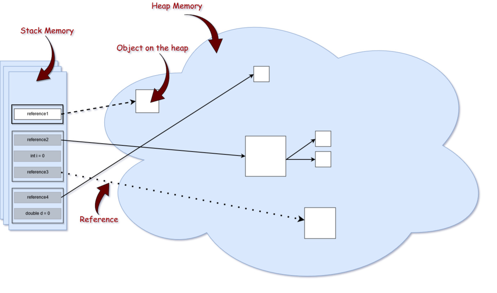
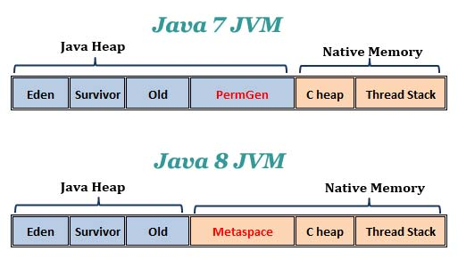

# Pourquoi mon application Java en production ne répond plus? - Quelques bases de profiling d'une JVM

## Périmètre

* Processus purement Java;
* On exclu :
** Réseau;
** Saturation des appels utilisateurs;
** Couches de présentation Web;
** Interdépendances de web services sur différentes machines.

## Rappels sur le fonctionnement de la JVM

### Structure de la mémoire

#### Stack (Pile)

Références vers des objets de la heap et vers les valeurs des primitives. La portée (scope) y est gérée. Chaque thread a sa propre stack.

#### Heap (Tas)

L'endroit où sont stockés les objets en mémoire.

Pour chaque processus JVM qui tourne, il existe une occurence de heap.

#### Type de références

* strong

`StringBuilder builder = new StringBuilder();`

* weak : ne survivera probablement pas au prochain processus de garbage collection. Peut être utilisé pour des stratégies de caching.

`WeakReference<StringBuilder> reference = new WeakReference<>(new StringBuilder());`

* soft : utilisé dans des scénarii sensible vis-à-vis de la mémoire. Cette mémoire sera collectée par le GC que si la mémoire disponible est basse (juste avant un OutOfMemoryError).

`SoftReference<StringBuilder> reference = new SoftReference<>(new StringBuilder());`

* phantom : Objets dont on est certain qu'ils n'ont plus aucune utilité.

#### Process de Garbage Collection

image::../assets/img/jpg/GarbageCollection_eligible-objects.jpg[Objets éligibles]

* Processus déclenché automatiquement par Java;
* Processus coûteux. Tous les threads de l'application sont mis en pause pendant qu'il s'exécute;
* Le proseccus est plus complexe que la détection de ressources non-utilisées et la libération de mémoire;
* Le fait de faire un `System.gc()` dans votre code "suggère" à la JVM d'appeler le GC, mais elle ne le fera pas obligatoirement tout de suite. Seulement quand elle sera prête. Et *attention*, il n'est pas recommandé d'appeler le GC. Vous risquez de perdre des données, et avoir des problèmes de performances.

### Java 1 à 7

image::../assets/img/png/PermGen.png[Java 1 à 7, structure de la heap]

### Java 8 et +

## Outils de profiling

* Utilitaires de la JVM (**/!\ Il est important d'utiliser la même JDK que la JVM qu'on veut analyser /!\**)
** *JConsole* : outil de surveillance de processus Java. Permet de connaitre :
*** Tableau de bord de la JVM;
*** L'état de la mémoire;
*** L'état des threads;
*** Les classes chargées;
*** Informations sur la JVM;
*** Etat des MBeans.
** *jhat - Java Heap Analysis Tool* : lance un serveur web qui permet d'analyser les heap dumps;
** *jmap - Memory Map* : génère un heap dump d'un processus;
** *jstack - Stack Trace* : liste les traces des threads d'un processus Java donné;
** *jstat - Java Virtual Machine Statistics Monitoring Tool* : affiche des statistiques de performances pour une JVM outillée.;
** *jstatd* : serveur RMI qui surveille la création et la terminaison de JVM outillées (intéressant pour connecter d'autres outils).
* VisualVM;
* Eclipse Memory Analyzer (MAT) : facilite l'analyse de heap dumps;
* Telegraf/Grafana
* PinPoint (APM open source);
* Outils payants :
** Java Flight Recorder : collecte des données sur la JVM;
** JProfiler;
** APM :
*** Dynatrace
*** AppDynamics

## VisualVM

* *Running* : le thread est toujours en cours d’exécution.
* *Sleeping* : le thread dort (la méthode yield () a été appelée sur l’object thread)
* *Wait* : le thread a été bloqué par un mutex ou une barrière et attend qu’un autre thread libère le verrou
* *Park* : les fils stationnés sont suspendus jusqu’à ce qu’ils reçoivent un permis. Le dépotage d’un thread se fait généralement en appelant la méthode unpark () sur l’object thread
* *Monitor* : les threads attendent une condition pour devenir vrais pour reprendre l’exécution

## Cas les plus courants :

* Saturation de la mémoire;
* Saturation de la stack (ex : apppels récursifs aux méthodes);
* Traitement long et consommateur de CPU;
* Ressource centralisée appelée par plusieurs traitements;
* Requête base de données non optimisée;
* Utilisateur qui a accès à un traitement réservé, d'habitude, aux batches.
